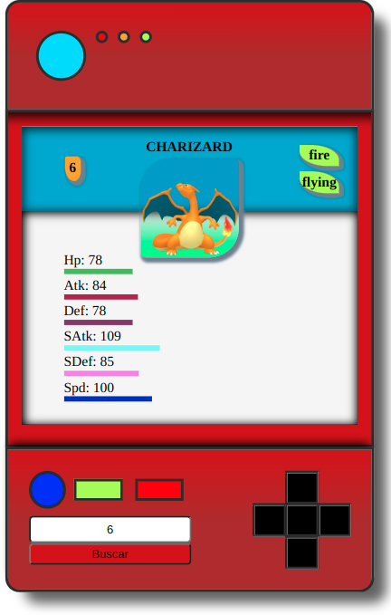

# Sobre
Para el desarrollo de la Pokédex se utilizo en su mayoria CSS, JavaScript para añadir funciones y se esta consumiendo la API de Pokeapi para obtener los datos del pokemon.

## redoPokedex
Se realizo como ejercicio para Launch X, pero me propuse el reto de volverlo a hacer ya que no me gusto como quedo mi primera versión.

## Sitios y herramientas

https://pokeapi.co/

https://css-tricks.com/

https://cssgradient.io/

https://html-css-js.com/css/generator/box-shadow/

## Actualización
La imagen.

Se añadio linear-gradient.

Se añadieron finalmente los tipos que tiene un pokemon.

Se estilizo los Tipos, ID y la imagen del pokemon.

## Imagen
